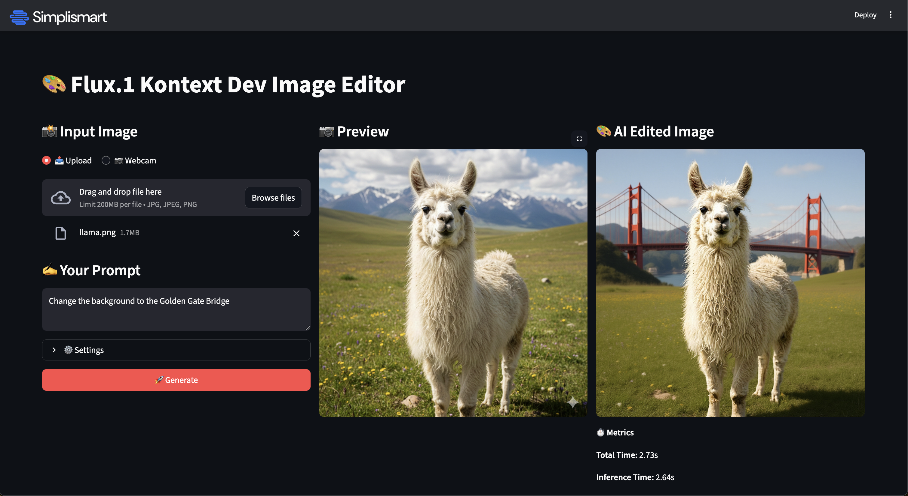

# 🎨 Flux.1 Kontext-dev Image Editor

A powerful, real-time image editing application built with Streamlit and powered by [Simplismart's optimized Flux.1 Kontext API](https://simplismart.ai/playground). This app demonstrates the capabilities of the FLUX.1 Kontext-dev model, which allows for native image-to-image editing with exceptional character consistency and speed.



## 🚀 Features

- **Native Image Editing**: Edit images using natural language prompts without complex adapters.
- **Real-time Performance**: Experience ~3.7s inference speeds thanks to Simplismart's optimizations.
- **Interactive UI**: User-friendly Streamlit interface with drag-and-drop upload and webcam support.
- **Customizable Settings**: Adjust guidance scale, inference steps, and resolution to fine-tune your results.
- **Performance Metrics**: View real-time inference latency for every generation.

## 🛠️ Prerequisites

- Python 3.8 or higher
- A Simplismart API Key (Get it from the [Playground](https://simplismart.ai/playground))

## 📦 Installation

1.  **Clone the repository:**

    ```bash
    git clone https://github.com/simpli-smart/cookbook.git
    cd cookbook/flux.1-kontext-dev
    ```

2.  **Create and activate a virtual environment (optional but recommended):**

    ```bash
    python -m venv venv
    source venv/bin/activate  # On Windows: venv\Scripts\activate
    ```

3.  **Install dependencies:**

    ```bash
    pip install -r requirements.txt
    ```

4.  **Set up environment variables:**

    Copy the template file:
    ```bash
    cp .env-template .env
    ```

    Open `.env` and add your Simplismart credentials:
    ```env
    SIMPLISMART_BASE_URL=your_endpoint_url_here
    SIMPLISMART_API_KEY=your_api_key_here
    ```

    > **Note:** You can get your API Key and Endpoint URL by visiting the [Simplismart Playground](https://simplismart.ai/playground), selecting "Flux Kontext" from the model dropdown, and clicking "Get API details".

## 🏃‍♂️ Usage

Run the Streamlit application:

```bash
streamlit run app.py
```

The app will open in your default web browser at `http://localhost:8501`.

1.  **Upload an Image**: Drag and drop an image or capture one via webcam.
2.  **Enter a Prompt**: Describe how you want to modify the image (e.g., "Change the background to a cyberpunk city").
3.  **Adjust Settings** (Optional): Expand the settings menu to tweak guidance scale or steps.
4.  **Generate**: Click the "Generate" button and watch the magic happen!

## 📂 Project Structure

- `app.py`: Main Streamlit application code.
- `requirements.txt`: List of Python dependencies.
- `.env-template`: Template for environment variables.
- `assets/`: Contains images and resources for the app.
- `samples/`: Example images for testing.

## 🔗 Resources

- [Simplismart Playground](https://simplismart.ai/playground)
- [API Documentation](https://docs.simplismart.ai)
- [Flux.1 Kontext Technical Blog](flux-kontext-technical-blog.md)
- [Technical Paper (arXiv)](https://arxiv.org/html/2506.15742v2)

---

Made with ❤️ by [Simplismart](https://simplismart.ai)
